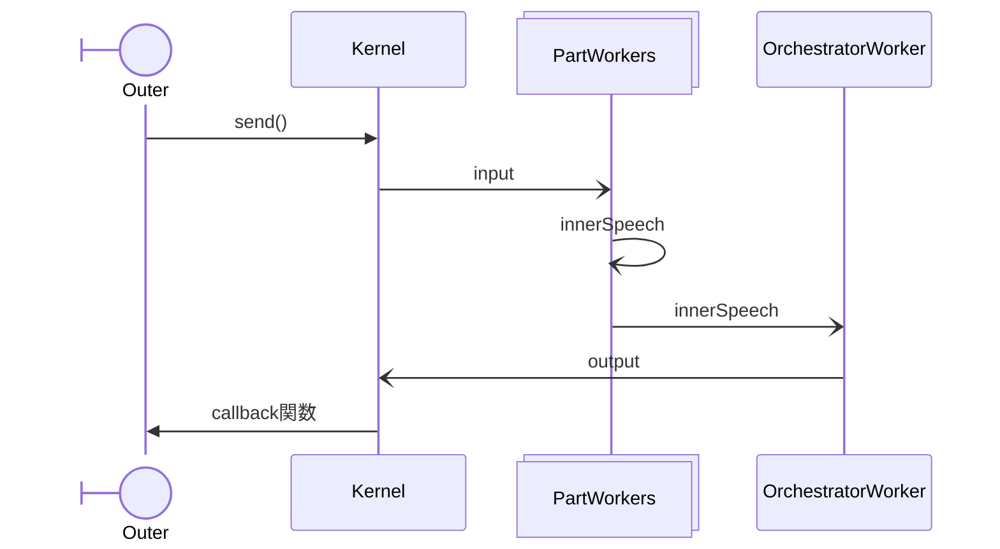

Orchestraotor
=============
* inputを受信したらタイマーを起動。設定時刻まで待機後メッセージを統合。outputを送信する。

## 設定ファイル
????.orchestrator.json
```json
{
    "description": "説明",
    "factor": {
        "intervals_msec": [300,200,250,200],
    }
}
```

## deploy
全てのpartをactivateするkernel向け司令を送信する。

## 動作機序


1. KernelからbroadcastChannel経由で全パートにinputメッセージが配信される。
2. inputを受信したらOrchestratorはfactor.intervalsからランダムに選んだインターバルの待機を開始。
3. 待機中に他のパートから配信されたinnerSpeechをプール。innerSpeechにはinnerSpeechToSelf(自分向けの独り言)とinnerSpeechToOther(外向けのつもりの発言)がある。
4. 待機終了時に以下の方法でoutputを選ぶ
  - innerSpeechToOtherがあればスコア上位3発言のうちからランダムに一つを選び以下 (A) と呼ぶ。
  - innerSpeechToSelfがあればスコア上位3発言のうちからランダムに一つを選び以下 (B) と呼ぶ。
  - (A)(B)のどちらかしか無い場合はそれをoutputする。
  - (A)(B)両方があり、(B)のスコア > (A)のスコアである場合(A)メッセージのmessage.emoを(B)のemoに差し替え、(A)をoutputとする。message.props.partNamesには(A)(B)両方の名前を記載する。
  - (A)(B)いずれもない場合、messageなしのoutputを送る。

## 競合状態の対処
### input受信後インターバルタイマ動作中にinputを受信したら
各パートではinnerSpeech出力がどのinputに紐づくか管理していないし、管理は複雑なので、kernel側でinput処理中のinput追加は禁止する。


