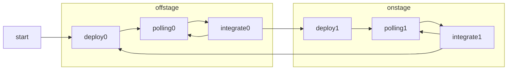

OrchestratorPart
================
* チャットボットの未登場↔登場という状態管理を行う。
* パートから受け取ったメッセージを蓄積し、定期的にそれらを統合して返答を返す

orchestrator.jsonには以下の内容を格納する
```json
{
    "title": "Orchestrator",
    "factor": {
        "intervals": [300,200,250],
        "attenuation": 0.7,
    },
    "botName": ["アウルラ"],
    "fallbacks": ["..."]
 
}
```

## 状態管理



### start
* bot用のbroadcast channelから内言messageを受け取ったら蓄積するイベントリスナーの開始
完了したらdeploy0に遷移
* report時返答: 状態名

### deploy0
* kernelに「orchestrator以外全パートdeactivate」をpost
* kernelに「offstageパートのactivate」をpost。
完了したらpolling0に遷移

* report時返答: 状態名


### polling0
* factor.intervalsからランダムに一つを選び、そのintervalでタイマーを開始。終了時にintegrate0に遷移

* report時返答: 状態名, インターバル開始時刻、インターバル長


### integrate0
* 内言メッセージ（パートからの発言）があればそれらのうち最もスコアの高いものを選びbroadcast channelに{type:'speech',message}でポスト。なお発言に"{ONSTAGE}"が含まれていたら{ONSTAGE}は削除しておく。
* 蓄積した全メッセージをクリア
* 発言に{ONSTAGE}があった場合deploy1に遷移。そうでなければpolling0に遷移。

* report時返答: 状態名,全メッセージリスト

### deploy1
* kernelに「orchestrator,以外全パートdeactivate」をpost
* kernelに「offstageパート以外のactivate」をpost
完了したらpolling1に遷移

* report時返答: 状態名,全メッセージリスト

### polling1
* factor.intervalsからランダムに一つを選び、そのintervalでタイマーを開始。終了時にintegrate1に遷移

### integrate1
* n番目に来たメッセージのスコアをattenuation^n倍することで減衰させる（＝話しすぎない）
* 返答が帰ってこなかった場合のフォールバックはfallbacksからランダムに一つを選んで使用。（スコアが低い場合は通常notFoundパートが返事をする。それもなかった場合なのでエラーの可能性が大きい）
* 最も高いスコアをhとしたとき、h*0.9以上を返答する。

* 発言の中に"{OFFSTAGE}"が含まれた場合、{OFFSTAGE}を除去して返答を行い、deploy0に遷移する。"{OFFSTAGE}"が含まれない場合はpolling1に遷移する。
* report時返答: 状態名,全メッセージリスト


## カーネルとの通信

### activate
{type: "activate"}
を受け取ったら
* broadcast channelからのメッセージを受け取るモードになる。
* {type: "activated"}をworkerのchannelにポストする

### deactivate
{type: "deactivate"}
を受け取ったらbroadcast channelからのメッセージを受け取らないモードになる。
* {type: "deactivated"}をworkerのchannelにポストする

### report
{type: "report"}を受け取ったら
{type: "reported", stateName, レポート内容}をworkerのchannelにポストする。