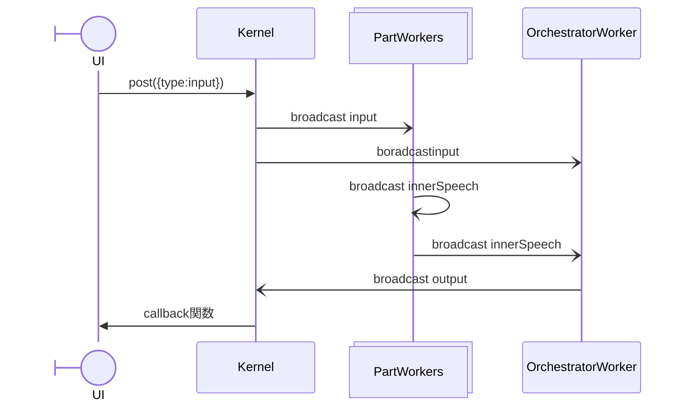

biomebotシステム概略



## パート

```json
{
  "title": "挨拶",
  "author":"skato",
  "tags": [
    {
      "surfaces": ["しまりすさん", "シマリスさん"],
      "embedding": {"{you}": 1.0}
    }
  ],
  "factor": {
    "activity": 0.6,
    "precision": 0.4,
    "intensity": 1.0
  },
  "columns": ["role", "text", "date", "time", "emo", "facing", "location"],
  "data": [
    "# 文字列はコメント行かつ話題の区切り",
    ["bot", "こんにちは", "10/12", "12:23", "laugh", "face", "private"],
    ["user", "今日はどう？", "10/12", "12:23", "", "face", "public"]
  ]
}
```

### factor
activity 1-0の乱数がこの値より大きいと反応しない
precision スコアがこの数値より低いと反応しない
intensity スコアを最終的にintensity倍にして報告