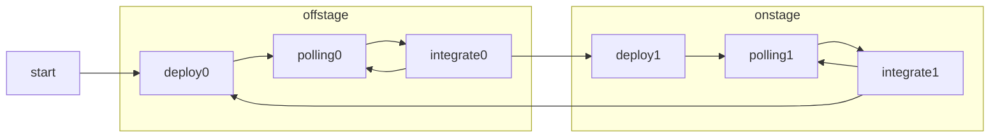

OrchestratorPart Class
=====================

OrchestratorPartはOrchestrator.jsをworker化するラッパー。
ユーザや環境からのメッセージはこのpartへのpostMessageで渡される。
UIへの返答はこのpartのeventListenerで渡す。
Orchestratorは受け取ったメッセージを専用のbroadcast channelにpostする。

## 受け取るmessageの形式
```javascript
message= {
        "role": "user" | "bot" | "eco",
        "text": string,
        "date": 1/1 ~ 12/31,
        "time": 0:00~23:59
        "emo": "joy" | "trust" | "fear" | "surprise" | "sadness" | "disgust"| " anger" | "anticipation",
        "facing": "face" | "back"
        "location": "private" | "public"
    }
```

チャットボットは以下のような状態遷移図に従って動作する

| 状態名       | 意味                                             |
|--------------|--------------------------------------------------|
| start        | orchestratorのセットアップ                       |
| deploy0      | offstageのdeploy                                 |
| polling0     | offstageのみ実行中                               |
| integration0 | 出現判定。出現する場合deploy1へ                  |
| deploy1      | offstage以外の全パートdeploy                     |
| polling1     | offstage以外の全パート実行中                     |
| integration1 | 返答の統合と発話                                 |



## start

## deploy0

* deploy0(botName, firestore_token)を実行。
  - offstageセクションを有効化
* 完了したらpolling0に遷移。

## polling0
* 設定したインターバルで待機しその間メッセージを蓄積
* 待機終了時にメッセージが蓄積されていたらintegration0へ。なければpolling0再始動

## integration0
* 蓄積したメッセージに対してretrieve0(message)を実行。
* 戻り値のtext中に"{START}"が含まれていたらdeploy1に遷移。("{START}"自体は出力文字列から除去)それ以外をメッセージとしてUIにポスト
* polling0に戻る

## deploy1
* offstageパートを破棄
* offstage以外の全パートをdeploy。
* 完了したらpolling1に遷移

## polling1
* 設定したインターバルで待機しメッセージを蓄積
* 待機終了時にメッセージが蓄積されていたらintegration1へ。なければpolling1再始動

## integration1
* 
deploy
* deployNotFound()を実行
* broadcast channelで全パートにdeployを要求→パートからの返答を待機し、全パートがdeployedになったらreadyに遷移

## ready

* メッセージ入力を待機
* メッセージをbroadcast channelを通して全パートに配信。intervalsから一つをランダムに選び、受容期間(msec)とし、pollingに遷移する。

## polling
受容期間の間broadcast channelから受け取ったデータをすべて保持する
その後 replyに遷移

## integration
* reply(messages)を実行する。
* UIにpostするとともにbroadcast channelにも「どのpartが採用された」という情報をpostする。
* 出力文字列に、"{BYE}"が含まれたらstandByに遷移する("{BYE}"自体は出力文字列から除去)
* そうでない場合readyに遷移する