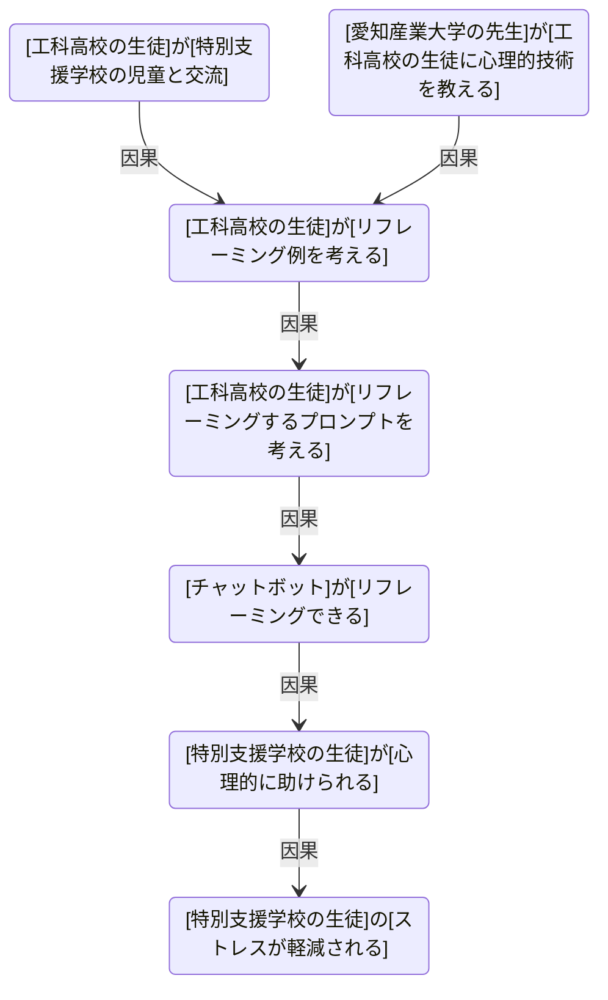

```mermaid
stateDiagram-v2
    [工科高校の生徒]が[特別支援学校の児童と交流] --> [工科高校の生徒]が[リフレーミング例を考える]: 因果
    [愛知産業大学の先生]が[工科高校の生徒に心理的技術を教える] --> [工科高校の生徒]が[リフレーミング例を考える]: 因果 
    [工科高校の生徒]が[リフレーミング例を考える] --> [工科高校の生徒]が[リフレーミングするプロンプトを考える]: 因果
    [工科高校の生徒]が[リフレーミングするプロンプトを考える] --> [チャットボット]が[リフレーミングできる]: 因果
    [チャットボット]が[リフレーミングできる] --> [特別支援学校の生徒]が[心理的に助けられる]: 因果
　　[特別支援学校の生徒]が[心理的に助けられる] --> [特別支援学校の生徒]の[ストレスが軽減される]: 因果
```

