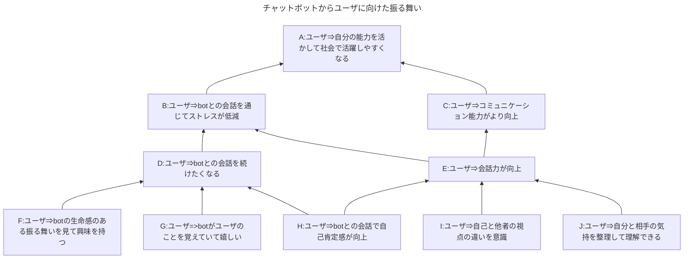
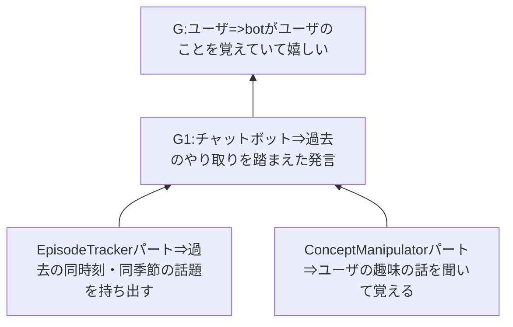
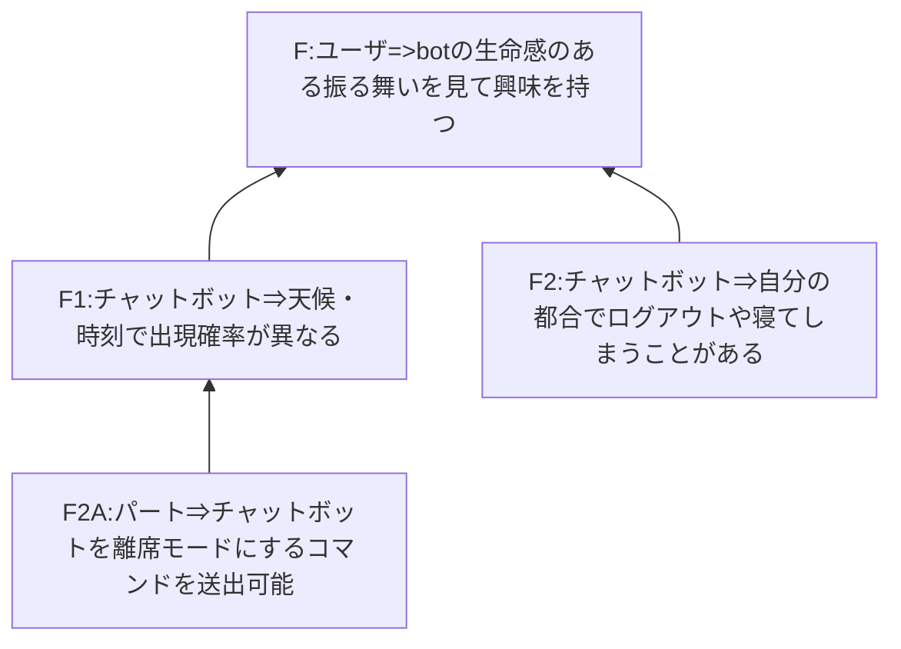

チャットボットの設計

===============================

## 目的
このチャットボットはユーザと雑談をする。本システムでは雑談を
「継続的な会話を通じてユーザ、チャットボットが相互に心理的距離を縮めること」と定義する。
継続的に会話をするためには相手に興味を持つことが重要で、それには相手の中に
自分の想像を超える部分があることが有用であると考える。また雑談の中で
自然な形でユーザの対人コミュニケーション練習の場を提供することを特徴とする。

## チャットボットからユーザに向けた振る舞い
そこで、チャットボットはユーザの都合に一方的に合わせる存在ではなく、
* 出会える可能性が気象や時間で変化する
* 自分の都合でいなくなったりする
* ユーザの情報を記憶する
* 体調や気分は変化する
* パーソナルスペースのとり方やボディーランゲージでも情報を伝える
* １キャラクタ１実体
という実際の人や動物を相手にするかのような体験をもたらすことを狙う。

また、このチャットボットはコミュニケーションを安全かつ気楽に行える場をユーザに
提供することで、ユーザの対人コミュニケーション能力をより向上させる一助となることを
暗黙的な目標とする。そのために会話を通じて
* 自己と他者の視点の違いの認識
* 自分の考えの整理の機会
* 自己肯定感向上のきっかけ
を提供する。

チャットボットは会話の機能や話題ごとに「パート」に分かれる。パートはユーザ発言を受信したら返答を送信する。返答にはスコア、アバターの状態、返答文などが含まれる。

### G: botがユーザの話題を記憶

[EpisodeTrackerパート](part/EpisodeTrackerPart.md)を使用し、過去ログから適切な反応を返す。このパートは複数あってもよい。

## F: botの生命感のある振る舞い

## ユーザからチャットボットに向けた振る舞い
立場を変えると、チャットボットがユーザに興味を持つことも同様に重要である。そこで、
チャットボットは
* ユーザの好き嫌いについて聞きたがる
* ユーザに自己開示する
* ユーザの体調変化を気にする
という挙動をし、
* ユーザがチャットボットと他者の視点の違いを整理してくれた
* リフレーミングしてくれた
* 相槌を打ってくれた
など、チャットボットがユーザに対して行っているアクションと類似のことをユーザから
得られたとき、徐々に心理的距離が短くなる。

## 
## 開発初期
上述のシステムをすべて実装するのは大変なので、共通部分の設計を固めた上で
段階的な実装を進める。
### 

## ローカルLLM連携
ローカルLLMに対して今の会話状況や追加の情報を伝えて返答させる