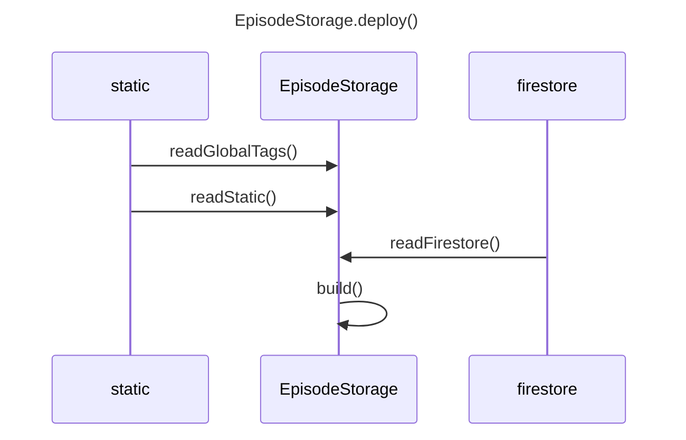
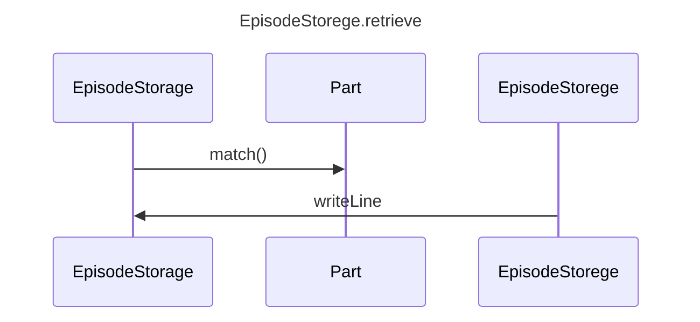

EpisodeStorage
==============

dexiejsを中核としたEpisodeTracker用のデータの保持と管理

## dexieのDB構造
firestoreSources={
    path: staticの*.episode.jsonファイルのパス
    timestamp: 上記ファイルのタイムスタンプ
    payload:
};
caches={
    botName,
    partName,
    timestamp,
    vocab,
    matrix
};

db = new Dexie("EpisodeStorage")
db.version(1).stores({
    firestoreSources: "++id,path",
    caches: "botName,partName",
})


## deploy
```javascript
/**
 * @param {string} botName - チャットボットの型式
 * @param {object} firestore - 接続済みのfirestoreインスタンス
 */
function deploy(botName,firestore);
```


アプリのビルド時にstatic/以下の階層をスキャンし、環境変数NEXT_PUBLIC_STATIC_FILESに格納しておく。
```javascript
NEXT_PUBLIC_STATIC_FILES = [
    "bot/alice/greeting.episode.json",
    "bot/alice/avatar/joy.svg"
]; 
```
* 引数で得たfirestoreはthis.firestoreにコピーする。
* deploy()はNEXT_PUBLIC_STATIC_FILES中の tags/global.jsonを探し、存在したらreadGlobalTags()を行う。
deploy()はNEXT_PUBLIC_STATIC_FILES中の bots/{botName}/*.episode.json を探し、
*をpartNameとして各partNameに対してreadStatic(botName,partName), readFirestore(botName,partName)を実行する。いずれかのタイムスタンプが記憶したものより新しい場合buildを行う。

### readGlobalTags
```javascript
/**
 */
function readGlobalTags();
```
tags/*.jsonに以下の形式で記載したタグ情報を取得。
```json
[
    {
        surfaces: ["兄","お兄さん","兄貴"],
        embedding: {"兄":1.0, "兄弟": 0.3,"家族": 0.1}
    },
    { 
        surfaces: ["兄弟","姉妹"],
        embedding: {"兄弟": 1.0, "姉妹": 0.6, "家族": 0.3}
    }, ...
]
```
以下を生成。
this.globalTags.dict: 順序付き辞書
- key=surfafce (surfacesの各要素)
- dictはsurface文字列の長い順にソート
- value={index:number, embedding:dict}。indexはsurfaceごとにインクリメント
　
備考
- 該当ファイルがなければ無視
- surfaceの重複は警告し無視。ファイル名とsurfaceが特定できる警告を出力
- 一つのembedding内のvalueは合計1となるように規格化する。

利用時の想定
人やbotのセリフ内にsurfaceで指定された文字列をが見つかったら
- その文字列を{t<index>}という文字列に置き換えてword vectorに加える。
- embeddingで示す畳み込み情報をword vectorに加える。

### readStatic
```javascript
/**
 * @param {string} botName - チャットボットの型式
 * @param {string} partName - パート名
 */
function readStatic(botName,partName);
```
readStaticは該当したjsonをfetchしてthis.staticSourceにそのまま格納する。形式は以下の通り。
```json
{
  "title": "挨拶",
  "author":"skato",
  "tags": [],
  "factor": {
    "activity": 0.6,
    "precision": 0.4
  },
  "timestamp": null,
  "columns": ["role", "text", "date", "time", "emo", "facing", "location"],
  "data": [
    "# 文字列はコメント行かつ話題の区切り",
    ["bot", "こんにちは", "10/12", "12:23", "laugh", "face", "private"],
    ["user", "今日はどう？", "10/12", "12:24", "", "face", "private"],
    null,
    ["bot", "元気ですよ。", "10/12", "12:25", "happy", "face", "private"]
  ]
}
```

またthis.staticSource.timestampはfetchしたファイルのtimestampで上書きする。

### readFirestore
```javascript
/**
 * @param {string} botName - チャットボットの型式
 * @param {string} partName - パート名
 */
function readFirestore(botName,partName);
```
firestoreの階層構造は以下を想定。
```
firestore
└bots collection
   └{botName} document
      └parts collection
         └{partName} document
```
* {partName}documentの内容をthis.firestoreSourceにコピーする。形式はthis.staticSourceで説明したものと同じ。
* firestore上に該当文書がない場合無視。

## build
staticSourceとfirestoreSourceのタイムスタンプのうちいずれかが
db.cache.timestampよりも新しい場合、以下の手順で類似度行列を生成。

### 1. validate
* static, firestoreともにepisode.jsonの書式は同じで、
以下のvalidateを行い、エラーがあれば報告する。
{
    "role": "user" | "bot" | "eco",
    "text": {string},
    "date": 1/1 ~ 12/31,
    "time": 0:00~23:59
    "emo": "joy" | "trust" | "fear" | "surprise" | "sadness" | "disgust"| " anger" | "anticipation",
    "facing": "face" | "back"
    "location": "private" | "public"
}

* globalTags
### preprocess

EpisodeTeackerPart.mdに記載した類似度行列計算を行い、
* vocab: 出現する全単語（トークン）のリスト
* matrix: 正規化済み・重み付け済み類似度行列
* などの類似度計算に必要な中間データをdb.cacheに書き込む。その後db.cache.timestampを更新する。
this.cacheにも計算結果を保持する。
this.cache.timestampが他のタイムスタンプより新しくない場合はdb.cacheを呼んでthis.cacheにコピーする。

## retrieve
```javascript
/**
 * @param {object} message 
 */
function retrieve(message);
```



### match()
```javascript
/**
 * @param {object} message 
 */
function match(message);
```
messageに含まれる単語のうちthis.globalTagsに存在するものはタグ化し、
this.globalTagsCacheに記憶する。
messageを解析してベクトル化し、this.cacheの間で類似度計算を行う。
スコアが高かった上位5件の中からランダムに一つを選び、タグが含まれていたらthis.globalTagsCacheを利用してタグ化の逆操作を行い、日本語化して
message形式で返す。

     