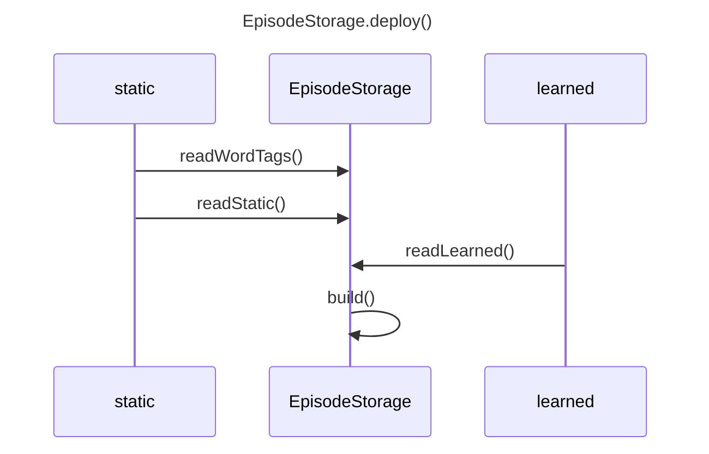
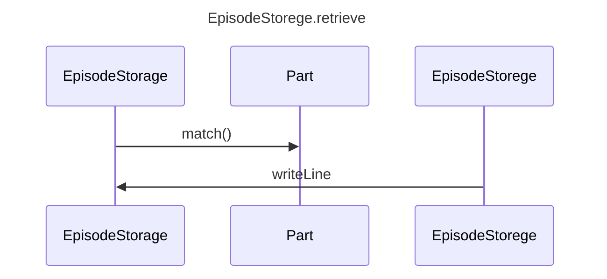

EpisodeStorage
==============

EpisodeStorageは予め用意したログやユーザとの会話ログから類似した発話を検索し、その次の行を返答候補として返す。
dexiejsに学習したデータと計算キャッシュを保持する。

## dexieのDB構造
firestoreSources={
    path: staticの*.episode.jsonファイルのパス
    timestamp: 上記ファイルのタイムスタンプ
    payload:
};
caches={
    botName,
    partName,
    timestamp,
    vocab,
    matrix
};

db = new Dexie("EpisodeStorage")
db.version(1).stores({
    firestoreSources: "++id,path",
    caches: "botName,partName",
})


## deploy
```javascript
/**
 * @param {string} botName - チャットボットの型式
 * @param {string} partName - チャットボットのパートの名前
 * @param {string} firestore_token - firestore REST APIのトークン
 */
function deploy(botName, partName,firestore_token);
```
- 指定したデータを読み込む
- Dexie DB に最新の前処理済み中間データがあればそれを読み込む。
- なければ static データまたは Firestore から元データを読み込み、特徴量行列を構築して Dexie DB に保存する。
- データバージョンや更新日時を保存し、static データと Dexie キャッシュの不整合を検知できるようにする。


アプリのビルド時にstatic/以下の階層をスキャンし、環境変数NEXT_PUBLIC_STATIC_FILESに格納しておく。
```javascript
NEXT_PUBLIC_STATIC_FILES = [
    "bot/alice/greeting.episode.json",
    "bot/alice/avatar/joy.svg"
]; 
```
* 引数で得たfirestoreはthis.firestoreにコピーする。
* deploy()はNEXT_PUBLIC_STATIC_FILES中の tags/global.jsonを探し、存在したらreadWordTags()を行う。
deploy()はNEXT_PUBLIC_STATIC_FILES中の bots/{botName}/*.episode.json を探し、
*をpartNameとして各partNameに対してreadStatic(botName,partName), readFirestore(botName,partName)を実行する。いずれかのタイムスタンプが記憶したものより新しい場合buildを行う。

### readWordTags
```javascript
/**
 * @param {string} path - タグファイルのパス
 */
function readWordTags(path);
```
tags/*.jsonに以下の形式で記載したタグ情報を取得。
```json
[
    {
        surfaces: ["兄","お兄さん","兄貴"],
        embedding: {"兄":1.0, "兄弟": 0.3,"家族": 0.1}
    },
    { 
        surfaces: ["兄弟","姉妹"],
        embedding: {"兄弟": 1.0, "姉妹": 0.6, "家族": 0.3}
    }, ...
]
```
以下を生成。
this.WordTags.dict: 順序付き辞書
- key=surfafce (surfacesの各要素)
- dictはsurface文字列の長い順にソート
- value={index:number, embedding:dict}。indexはsurfaceごとにインクリメント
　
備考
- 該当ファイルがなければ無視
- surfaceの重複は警告し無視。ファイル名とsurfaceが特定できる警告を出力
- 一つのembedding内のvalueは合計1となるように規格化する。

利用時の想定
人やbotのセリフ内にsurfaceで指定された文字列をが見つかったら
- その文字列を{t<index>}という文字列に置き換えてword vectorに加える。
- embeddingで示す畳み込み情報をword vectorに加える。

### readStatic
```javascript
/**
 * @param {string} botName - チャットボットの型式
 * @param {string} partName - パート名
 * @param {string} sectionName - 
 */
async function readStatic(botName,partName,sectionName=null);
```
readStaticは該当したjsonをfetchしてthis.staticSourceにそのまま格納する。形式は以下の通り。
```json
{
  "title": "挨拶",
  "author":"skato",
  "tags": [
    {
      "surfaces": ["しまりすさん", "シマリスさん"],
      "embedding": {"{user}": 1.0}
    },
    {
      "surfaces": ["アウルラ"],
      "embedding": {"{bot}": 1.0}
    },
  ],
  "factor": {
    "activity": 0.6,
    "precision": 0.4
  },
  "timestamp": null,
  "columns": ["role", "text", "date", "time", "emo", "facing", "location"],
  "data": [
    "# 文字列はコメント行かつ話題の区切り",
    ["bot", "こんにちは", "10/12", "12:23", "laugh", "face", "private"],
    ["user", "今日はどう？", "10/12", "12:24", "", "face", "private"],
    null,
    ["bot", "元気ですよ。", "10/12", "12:25", "happy", "face", "private"]
  ]
}
```
tag中に"{user}","{bot}"にembeddingされるタグを記載しておく。"{user}","{bot}"はそれぞれこの会話ログが記録されたときのユーザとチャットボットの名前を示す。
sectionNameが指定された場合は
```javascript
{ [sectionName]: {
    "tag": [],
    "columns": [],
    "factor": [],
    "data": []
}}
```
のように[sectionName]内に記述された内容を使用する。
またthis.staticSource.timestampはfetchしたファイルのtimestampで上書きする。

### readLearned
```javascript
/**
 * @param {string} botName - チャットボットの型式
 * @param {string} partName - パート名
 */
async function readLearned(botName,partName);
```
firestoreに学習で取得したログを記憶しておき、
readLearnedでそれを呼び出す。
firestoreの階層構造は以下を想定。
```
firestore
└bots collection
   └{botName} document
      └parts collection
         └{partName} document
```
* {partName}documentの内容をthis.firestoreSourceにコピーする。形式はthis.staticSourceで説明したものと同じ。
* firestore上に該当文書がない場合無視。

## build
```javascript
/**
 * @param {string} botName - チャットボットの型式
 * @param {string} partName - パート名
 */
function build(botName,partName);
```
staticSourceとfirestoreSourceのタイムスタンプのうちいずれかが
db.cache.timestampよりも新しい場合、両方のデータを用いて以下の手順で類似度行列を生成。

注：2027/6/21現在、タイムスタンプ比較は未実装（dexiejsへの保存が未実装のため）

### 1. validate
* static, firestoreともにepisode.jsonの書式は同じで、
以下のvalidateを行い、エラーがあれば報告する。
    "tags": [
        {
        "surfaces": ["しまりすさん", "シマリスさん"],
        "embedding": {"{you}": 1.0}
        }
    ],
    columns: ["role","text","date","time","emo","facing","location"]の中から一つ以上が選ばれていること
    data: 行データの配列。行データはcolumnsで定義された順に値を並べた配列。columnsごとに以下の定義に従う。
    {
        "role": "user" | "bot" | "eco",
        "text": string,
        "date": 1/1 ~ 12/31,
        "time": 0:00~23:59
        "emo": "joy" | "trust" | "fear" | "surprise" | "sadness" | "disgust"| " anger" | "anticipation",
        "facing": "face" | "back"
        "location": "private" | "public"
    }

### 2. tagging
1. /static/*.tags.jsonファイルreadWordTags()でthis.wordTagsに読み込む
2. staticSource.tagsがあればreadWordTags()同様の処理を経てthis.wordTagsに上書きする
3. firestoreource.tagsがあればreadWordTags()同様の処理を経てthis.wordTagsに上書きする。


### 3. text embedding
1. null行やテキスト行は話題の区切りとみなし、ブロックに分割する。
2. テキストをtinySegmenterで簡易に分かち書きし、要素のリストを逆順にたどる。
3. 要素が格助詞、副助詞、接続助詞と思われるばあいその前の要素を再結合したものについてwordTagsに含まれるか調べる。含まれる場合はそのembeddingをwordVectorに加える。
4. 含まれない場合は前の要素と再結合した要素を0.5ずつの重みで特徴量に加える。つまり
```
キメラは → {"キメラ": 0.5, "キメラは": 0.5}
``` 
とする。こうすることで
「私は学校に行く」「学校に私は行く」
のように文節の位置を交換しても意味が同じ文についてwordVectorも同じにできる。また「私立大学」の「私」のように一人称ではない「私」を誤判定する可能性を小さくできる。

5. ブロックごとに `this.wordVector = [[block1],[block2],...]` のように2次元配列として格納する。ここで、separator 行は wordVector に加えない。
6. ブロックごとにdataのindexを`this.indexMap = [[block1],[block2],...]`のように2次元配列として格納する。ここでseparator行はindexMapに加えない。

※5,6 では separator 行を除外する。separator 行は話題の区切りであり、埋め込み対象にはならない。またブロック末尾の行を除外する。ブロック末尾はretrieveで仮にヒットした場合返答になるべきn+1行が存在しないため、検索にヒットさせないため埋め込み対象にしない。

### 4. attention embedding
1. 最新入力を `x_n` として埋め込みを生成する。
2. ブロック内の各行 `x_i` との類似度 `Score(n, i)` を計算する。
3. Softmax で重み `α_i` を生成する。

```text
Score(n, i) = x_n · x_i
α_i = softmax(Score(n,1), ..., Score(n,n-1))
Context_n = Σ_i α_i x_i
```
4. this.wordVectorを平坦化(raval)する。this.indexMapを平坦化する。

### 5. 全類似度行列の生成

EpisodeTeackerPart.mdに記載した類似度行列計算を行い、
* vocab: 出現する全単語（トークン）のリスト
* matrix: 正規化済み・重み付け済み類似度行列


`build()`ではまずテキスト埋め込みから得た `this.wordVector` の全トークンを走査し、
`vocab` を生成します。`vocab` はトークンを昇順でソートした配列です。

次に `matrix` を生成します。各ブロック内のアイテムごとに同じ行のトークン間の重み積
`weightA * weightB` を加算し、各行を合計で正規化します。これにより、トークンごとの関連度
が重み付けされ、行ごとの確率分布として扱えるようになります。

最終的に `botName` / `partName` で識別されるキャッシュエントリとして Dexie の `caches` ストアに
`{ botName, partName, timestamp, vocab, matrix }` を保存します。

既存キャッシュが `source.timestamp` より新しい場合は、再構築を行わずにそのまま `this.cache`
にコピーして使います。キャッシュが古い、または存在しない場合は、新たに生成して保存します。

## retrieve
```javascript
/**
 * @param {object} message 
 */
function retrieve(message);
```
1. messageを受け取ったら `this.messageHistory` 配列に追加する。
2. messageの本文をベクトル化し、`this.vector` に保持する。
3. `build()` で生成した `this.wordVector` を平坦化し、各行の埋め込みとメッセージ埋め込みの類似度を計算する。
4. 類似度がfactor.precisionより高いなかで上位4件を選び、ランダムに1件を選択する。
5. 選択した行の元データの次の行を `this.dataRows` から探しoutMessageとする。

6. this.wordTagsのキーを順に（＝長い順に）しらべ、キー文字列がmessageの中に含まれていたら記憶し、outMessage.textにそれを反映する。それによりmessageに'お兄さん'が含まれ、outMessageに同じタグに属する'兄'が含まれていたらoutMessageの'兄'を'お兄さん'に置き換える。
このwordTagsの情報はインスタンスが持続する間保持する。



### match()
```javascript
/**
 * @param {object} message 
 */
function match(message);
```
messageに含まれる単語のうちthis.WordTagsに存在するものはタグ化し、
this.WordTagsCacheに記憶する。
messageを解析してベクトル化し、this.cacheの間で類似度計算を行う。
スコアが高かった上位5件の中からランダムに一つを選び、タグが含まれていたらthis.WordTagsCacheを利用してタグ化の逆操作を行い、日本語化して
message形式で返す。

     
### templatize(text)
this.wordTagに含まれる文字列keyがtext中に見つかったら
* それを"{WT"+this.wordTag[key].index+"}"という文字列に置換
* this.memory["{WT"+this.wordTag[key].index+"}"]=置換前の文字列
この処理をwordTagの全keyについて行う。

### detemplatize(text)
{WT12}のようなタグがtext中に見つかったらthis.memory["{WT"+number+"}"]の内容でタグの部分を置き換える


