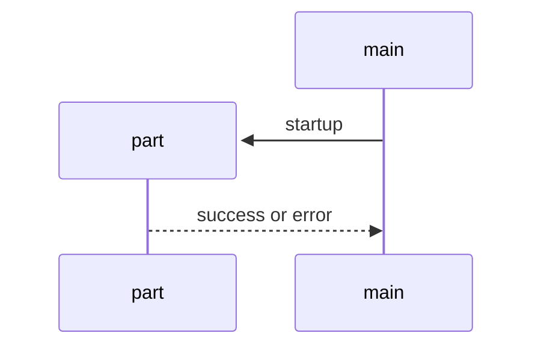
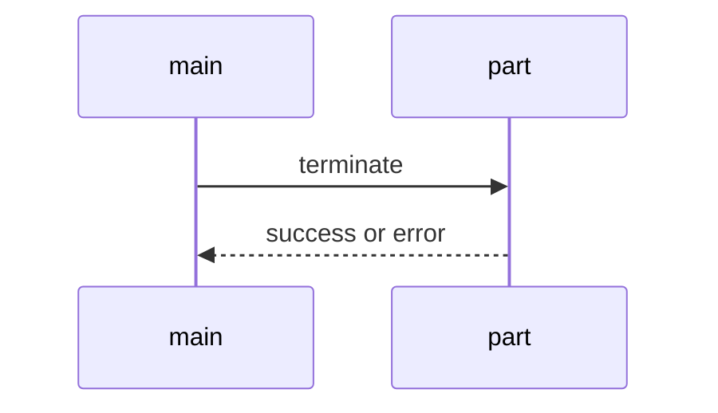

Biomebot 
========================

Biomebotは以下の方法でキャラクタを表現するチャットボットである。
* 複数のパートが並列的・競争的に動作
* パートには概念記憶を扱う概念パートと、エピソード記憶を扱うエピソードパートがある。
* 概念パートでは簡易的なtripleのDBを利用してユーザやチャットボットの情報を記憶・想起する
* エピソードパートではログの類似度行列を用いた簡易的なテキスト検索を用いた返答を行う。
* チャットボットの記憶はサーバー上に保存されるが、30人程度のグループ内のみで共有
  する。

## パートの実行管理
### パートの起動



mainは起動時に管理下の全パートに対してstartupを試みる。
partから受け取った応答をmainはログに記憶する。
全てのpartが起動に成功したら

### パートの停止

l


Biomebotは複数のpartを並列的・競争的に動作させることでキャラクタを表現するチャットボットである。
system controlではpartの稼働状況の表示、および起動・停止の操作を提供する。
UI上ではコンソールにworkerctlと入力すると別にウィンドウが開き、そこに
workerのリストと稼働状況が表示される。

## partの実行管理
biomebotが実行できるpartはstatic/botModulesに記述する。
botModules直下のディレクトリ名がchatbotの型式で、ディレクトリ内に格納した以下のファイルを認識する。

| file           | 動作             | worker
|----------------|------------------|-------------------
| main.concept   | 起動停止の制御   | concept.worker.js
| *.concept      | 概念パート       | concept.worker.js
| *.episode      | エピソードパート | episode.worker.js

```
実際の起動状況はadmin画面で確認・操作できる。
管理画面では起動、停止、disableの操作ができる。

{
    directory: ディレクトリ名,

    status: 'alive':生きている
            'dead':応答なし
            'starting':起動中
            '':起動していない
}
```

## チャットボット動作との関連
biomebotが機動したら*.auto.conceptと*.auto.episodeが起動される。
`*.concept`や`*.episode`の中で出力文字列に
`{SYSTEM_START_MODULES}`を含めると同じディレクトリの全パートに起動コマンドを送り、
`{SYSYEM_STOP_MODULES}`を含めると同じディレクトリにあり.auto.以外のパートに停止コマンドを送る。
これにより呼ばれていない妖精に声をかけたら現れる、という挙動やさよならする
ことで妖精が不在状態に移行することが表現できる。
`{ROLL_FOR_ENCOUNTER}`は設定した確率で妖精が出現するかどうかを表す。
