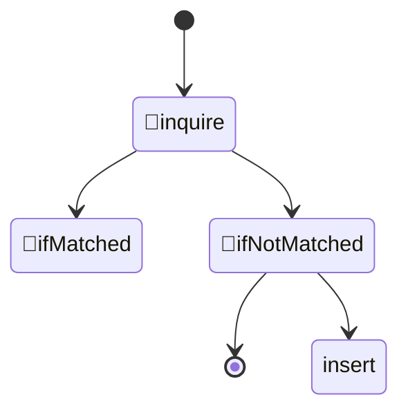
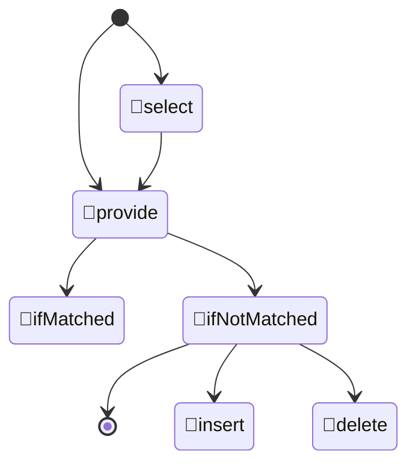
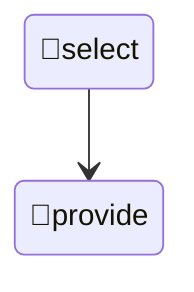

biomebot-0.20
========================================

# シンボル

| 名前           | 例           | 概要                   |
|----------------|--------------|------------------------|
| 概念タグ       | {:CONCEPT}   | 概念を記述するタグ     |
| 述語概念タグ   | {:predicate} | tripleの述語を記述     |
| システム変数   | {SYSTEM}     | 使用時に解決される変数 |
| 永続変数       | {Persistent} | 記憶が永続する変数     |
| セッション変数 | {session}    | セッション中の変数     |

## 名寄せ

概念とは「りんごは赤い」のような言及の形式で提示され、 subject, predicate, object のtripleで記述する典型的な方法を用いる。概念の最も基本的な機能は**名寄せ**で、「りんご」「リンゴ」「林檎」「アップル」のように表層形が異なっていても意味が同じ概念を一つのシンボルに集約することである。

```
{:FOOD} {:called} 食べ物,食料,フード
```
チャットボット辞書の入力文字列に含まれる「食べ物」や「フード」はいずれも{:FOOD}に置き換えられる。同時に置き換えられる前の文字列は{food}というセッション変数に保持される。
また出力文字列に含まれる「食べ物」も一旦{:FOOD}に置き換えられ、{food}を経由して最初に記憶された文字列に置き換えられる。これにより一つのテキストから意味の似た様々な文を生成する。

## 概念

tripleの記法を用いることで様々な概念を記述していくが、あらゆる概念に共通するpredicateは :called、:isA、:describedAs の３つである。

```
{:AURULA} {:called} アウルラ
{:AURULA} {:isA} {:AIR_FAIRY}
{:AURULA} {:describedAs} 羽のある空気の妖精
```

{?s} {:called} {?o} は概念{?s}の名前が{?o}であることを表し、複数をカンマ区切りで並べても良い。
{?s} {:isA} {?o} は概念{?s}が概念{?o}の下位概念であることを示す。
{?s} {:describedAs} {?o} は「{?s}とはなにか？」と質問されたときに{?s}を説明する文言である。

### 上位概念を使った類似度計算
{:NUTS} {:isA} {:FOOD}, {:TOMATO} {:isA} {:FOOD}という知識を使うことで
「{:NUTS}が好き」「{:TOMATO}が好き」という２つの文が似ているということを計算に組み込みたい。
これを実現するため、概念{:NUTS}がベクトル化される際、上位概念である{:FOOD}も重み0.3などでベクトル化するようにする。


## 述語概念タグ
すでに例を示しているが、camelCaseで記述した{:predicate}を述語概念タグと呼ぶ。

## 問い合わせに対する応答
妖精は自身について下記のような知識を持っており、ユーザからの問い合わせに答えることができる。

```
{:SPHAERA} {:called} スパエラ
{:SPHAERA} {:isA} {:WATER_FAIRY}
{:SPHAERA} {:describedAs} 青い水の妖精。
{:SPHAERA} {:likes} {:AURULA}
{:SPHAERA} {:friendOf} {:AURULA}
{:SPHAERA} {:likes} {:FAILY_WATER}
{:SPHAERA} {:knows} {:IWATOKO}
{:SPHAERA} {:dislikes} {:SWAMP_FAILY}
```

ユーザからの質問は不明部分のあるtripleとして認識され、そのパターンにマッチした{?o}を文字列化して返す。

例：
```
# user スパエラの好きなものって何？　→ bot 妖精の水だよ
{:likes} {:patternedBy} {:LIKE_WHAT_PATTERN}
{:LIKE_WHAT_PATTERN} {:listen} user {?s}の好きなものって何？ := {?s} {:likes} {?o}
{:LIKE_WHAT_PATTERN} {:matched} bot {?o}だよ
```
この場合、:queryでは{?o}が解決されず、知識の中でパターンにマッチした{?o}が代入されて{:response}が作られる。

例：
```
user スパエラってアウルラのこと好き？ -> bot うん
{:likes} {:patternedBy} {:DO_YOU_LIKE_PATTERN}
{:DO_YOU_LIKE_PATTERN} {:listen} user {?o}って{?s}のこと好き？ := {?s} {:likes} {?o}
{:DO_YOU_LIKE_PATTERN} {:matched} bot うん
{:DO_YOU_LIKE_PATTERN} {:notMatched} bot よくわかんない
```
こちらは真偽を聞くもので、{:query}の時点で{?s}と{?o}が解決されてしまう。その結果
知識の中でマッチした場合は{:matched}を、マッチしなかった場合は{:notMatched}を返す。好きであるという情報がなかった場合は「嫌い」と「よく知らない」のどちらの可能性もある。

例：
```
user スパエラってアウルラのこと好き？ -> bot ちょっと苦手
{:likes} {:patternedBy} {:DO_YOU_LIKE_PATTERN2}
{:DO_YOU_LIKE_PATTERN2} {:listen} user {?o}って{?s}のこと好き？ := {?s} {:dislikes} {?o}
{:DO_YOU_LIKE_PATTERN2} {:matched} bot ちょっと苦手
{:DO_YOU_LIKE_PATTERN2} {:notMatched} bot どうかな
```
同じ質問に対して返答可能なパターンを複数記述できる。複数マッチした場合はランダムに選ばれた一つが解決される。前の例と同じく「好き？」という質問に対する真偽を聞いているが、実際には{:disliked}を使って嫌いであるかどうかをチェックしている。これにより好きと聞かれて苦手と答えることができる。


## 妖精の名付け
妖精にはニックネームを付与することができる。名付けは相手を支配する言語呪術であり、重要な要素である。
```
user アウルラのこと、ルラって呼んでいい？ -> bot 「ルラ」だね。いいよ！
{:called} {:patternedBy} {:NICKNAME_PATTERN}
{:NICKNAME_PATTERN} {:listen} user {?s}のこと{?o}って呼んでいい？ 
{:NICKNAME_PATTERN} {:matched} bot {?o}だね。
{:NICKNAME_PATTERN} {:insert} user ありがとう！:={?s} {:called} {?o}
{:NICKNAME_PATTERN} {:revise} user ちがうよ。{?o}だよ！

```

## ユーザについての概念とその学習
チャットボットがユーザと知り合ったとき、チャットボットには
```
{:USER01} {:called} {:WANTED} # まずは名前を聞くところから
{:USER01} {:isA} {:HUMAN} # 多分人間でしょう
{:USER01} {:describedAs} {:WANTED}
{:USER01} {:likes} {:WANTED}
{:USER01} {:likes} {:WANTED} # 複数置くことで複数の知識を聞く
{:USER01} {:dislike} {:WANTED}
{:USER01} {:dislike} {:WANTED}
{:USER01} {:friendOf} {:WANTED}

{:USER01} {:isConnected} 1  # ユーザとコネクト状態にある
{:USER01} {:files} {:USER01_240112}  # この項目はログインした日ごとに増える
{:USER01_240112} {:sounds} {:WANTED} # 今日の状態
```
という知識がinsertされる。このWANTEDを減らすことがチャットボットの動機である。


チャットボットが未知の単語をユーザから教えられたとき、チャットボットには
```
{:CONCEPT001} {:called} ラーメン
{:CONCEPT001} {:isA} {:WANTED}
{:CONCEPT001} {:describedAs} {:WANTED}
{:USER01} {:WANTED} {:CONCEPT001}
```
という知識がinsertされる。これらに書かれた{:WANTED}は空欄を意味し、この{:WANTED}をなくすことがチャットボットの動機の一つとなる。{:WANTED}をなくすには優先順位があり、

## やり取りを通した未知の概念の学習
### ユーザの名前を知る
{:called}が{:WANTED}になっているのは最も優先して解決すべき状況である。そのためチャットボットは最初にユーザの名前を尋ねる。

{:called} {:patternedBy} {:YOUR_NAME_PATTERN}
{:YOUR_NAME_PATTERN} {:select} bot {:USER01} {:called} {:WANTED} := はじめまして！お名前なんていうの？
{:YOUR_NAME_PATTERN} {:accept} user {?name}です。
{:YOUR_NAME_PATTERN} {:insert} bot {?name}さんだね。よろしくね。私は{:AURULA}だよ。:= {:USER01} {:called} {?name}

### 林檎は食べ物の一種？

bot 林檎って食べ物？  (query)
user そうだよ  (yes)

bot 林檎って乗り物？  (query)
user いや、リンゴは食べ物だね。 (referTo)

bot リンゴって何？ (query)
user 食べ物。 (referTo)

というようなやり取りを通して{:CONCEPT02} {:isA} {:FOOD} という知識が獲得される。
これらのパターンも以下のように知識として表現する。

{:isA} {:parsedBy} bot {?s}って{?o}？
{:isA} {:referTo} user {?s}は{?o}だね。:= {?s} {:isA} {?o}

## 常識
```
{:HUMAN} {:isA} {:PARTICIPANT}
{:HUMAN} {:called} 人間
{:FAIRY} {:isA} {:PARTICIPANT}
{:FAIRY} {:called} 妖精,フェアリー
{:AIR_FAIRY} {:isA} {:FAILY}
{:AIR_FAIRY} {:called} 空気の妖精
{:AIR_FAIRY} {:describedAs} 羽があって、空を飛ぶ妖精
{:WATER_FAIRY} {:isA} {:FAILY}
{:WATER_FAIRY} {:called} 水の妖精
{:WATER_FAIRY} {:describedAs} 
{:EARTH_FAIRY} {:isA} {:FAILY}
{:EARTH_FAIRY} {:called} 大地の妖精
```

## 知識操作predicate
知識の読み出し、更新などに関係するpredicateはチャットボットと人間のやり取りを表したもので、下記のような状態遷移を行う。





```
# ユーザからの質問 → チャットボットの知識提供
{:inquireByUser} {:isDefinedAs} {:INQUIRE_LIKE}
{:LIKE_MODEL} {:parse} user {?o}って{?s}のこと好き？ := {?s} {:likes} {?o}
{:LIKE_MODEL} {:ifMatched} bot 好きだよ！
{:LIKE_MODEL} {:ifNotMatched} bot そうでもない　 

# ユーザからの情報提供 → チャットボットの知識追加または削除
{:provideByUser} {:isDefinedAs} {:PROVIDE_NAME}
{:NAME_MODEL} {:parse} user {?o}って{?s}の名前だよ := {?o} {:isA} {?x} and {?x} {:called} {?s}
{:NAME_MODEL} {:ifMatched} bot 知ってる！
{:NAME_MODEL} {:ifNotMatched} bot そうなんだ！ {:INSERT_ISA}

{:INSERT_ISA} {:insert} {?s}は{?o}、だね！ := {?s} {:isA} {?o}
```

```
# チャットボットからの質問 ＝＝＝＞ ユーザからの情報提供へつづく
{:selectByBot} {:isDefinedAs} {:SELECT_NAME}
{:SELECT_NAME} {:parse} bot {:USER01} {:called} {:WANTED} := はじめまして！お名前なんていうの？

# チャットボットからの情報提供
{:selectByBot} {:isDefinedAs} {:SELECT_MESSAGE}
{:SELECT_NAME} {:parse} bot {:USER01} {:has} {:MESSAGE} := {:USER01}さんにメッセージがあるよ


```

### {:listen}  
例：
```
{:DO_YOU_LIKE_PATTERN2} {:listen} user {?o}って{?s}のこと好き？ := {?s} {:dislikes} {?o}
```

{:listen}以降は <話者> <pattern> := <triple>という書式で、<話者>はユーザの可読性のために記述するもので、無視する。チャットボットへの入力が<pattern>にマッチしたばあい、それを<triple>に変換し、その条件に一致する知識を検索する。発見した場合は{:matched}が、発見しなかった場合は{:notMatched}を出力する。

### {:matched}と{:notMatched}
例：
```
{:DO_YOU_LIKE_PATTERN2} {:matched} bot ちょっと苦手
{:DO_YOU_LIKE_PATTERN2} {:notMatched} bot どうかな
```
{:matched}, {:notMatched}以降はチャットボットの出力として扱う。つまり「bot」はavatar指定でも良く、タグ表記は日本語にレンダリングされる。

### {:revise}
例:
```
{:revise} user それは{?o}だよ
```

### {:insert}
例：
```
{:insert} user ありがとう！:={?s} {:called} {?o}
```

## チャットボットが知りたいことをユーザに問い合わせ
チャットボットが知らないことは{:WANTED}のあるtripleという知識である。{:WANTED}をなくすためチャットボットはユーザに対して質問を行う。


自分の知識に問い合わせ{:select} 
          ├─────────┐
ユーザが情報提供 {:provide}   提供拒否{:notProvide}
          │
確認{:confirm}
          │
ユーザが訂正要望 {:claim} 
          │
情報提供を要望 {:prompt}
          │
ユーザが情報提示 {:revise}
          │
確認{:confirm}
          │
記憶する{:insert}


{:YOUR_NAME_PATTERN} {:select} bot {:USER01} {:called} {:WANTED} := はじめまして！お名前なんていうの？
{:YOUR_NAME_PATTERN} {:accept} user {?name}です。
{:YOUR_NAME_PATTERN} {:insert} bot {?name}さんだね。よろしくね。私は{:AURULA}だよ。:= {:USER01} {:called} {?name}


## ユーザとのコネクト状態管理
妖精はユーザと会話中の間コネクト状態になり、次回起動時も姿を見せるようになる。
この記憶はチャットボットの知識
{:USER01} {:isConnected} 1
で表され、チャットボットやユーザからの操作によりコネクト状態は解除できる。
なお、アプリ起動時にはすべてのチャットボットについてこれをチェックする必要がある。
これはindexedDB内のデータ確認で実行し、firestoreは利用しない。